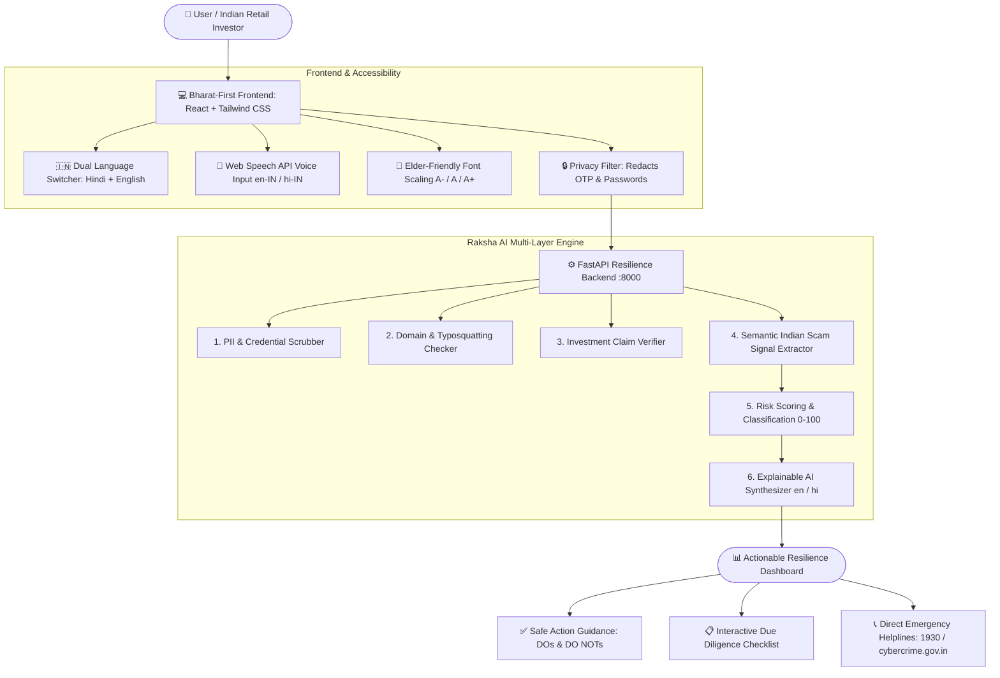

# 🛡️ Raksha Investor (रक्षा इन्वेस्टर)
> **"Check Before You Trust."** — AI-Powered Digital Fraud & Scam Resilience Assistant for Indian Investors.

[](https://github.com)
[](https://github.com)
[](https://considered-beverage-railroad-newcastle.trycloudflare.com)
[](https://github.com)

> 🌐 **Live Public Deployment (Open on any Mobile or Laptop):**  
> **[https://considered-beverage-railroad-newcastle.trycloudflare.com](https://considered-beverage-railroad-newcastle.trycloudflare.com)**


---

## 📌 1. Project Overview & Philosophy

**Raksha Investor** is an AI-powered Digital Fraud and Scam Resilience Assistant designed specifically for Indian retail investors. As millions of citizens from Tier-2 and Tier-3 cities take their first steps into financial markets, unscrupulous scammers exploit their hopes using fake WhatsApp stock groups, guaranteed-return Ponzi schemes, fake bank KYC messages, and withdrawal-fee crypto traps.

### 🚫 What Raksha Investor is NOT
* It is **NOT** an investment recommendation platform.
* It does **NOT** tell users what stock, crypto, or mutual fund to buy.
* It does **NOT** provide financial return advice.

### 🎯 Core Purpose: The Resilience Cycle
$$\text{DETECT} \longrightarrow \text{EXPLAIN} \longrightarrow \text{WARN} \longrightarrow \text{GUIDE SAFELY}$$

---

## 🏗️ 2. System Architecture



---

## 🌟 3. Features Implemented

| # | Feature | Status | Description |
|---|---|---|---|
| **F1** | **Scam Message Analyzer** | ✅ Active | Analyzes WhatsApp, Telegram, SMS, Social Media, and Email messages for 50+ scam vectors. |
| **F2** | **Explainable AI** | ✅ Active | Answers *"What we detected"*, *"Why it matters"*, and *"What to do"* in simple, plain language. |
| **F3** | **Investment Claim Checker** | ✅ Active | Distinguishes verified, unverified, and predatory claims (e.g. 40% guaranteed returns). |
| **F4** | **Suspicious Link Checker** | ✅ Active | Structural analysis: typosquatting, brand impersonation (SBI/HDFC/SEBI), APK downloads, HTTP/HTTPS. |
| **F5** | **"What Should I Do Now?"** | ✅ Active | Educational side-by-side DOs (✅) and DO NOTs (❌) for investor resilience. |
| **F6** | **Bharat-First Experience** | ✅ Active | 1-Click Toggle between 🇮🇳 English and 🇮🇳 हिंदी across all screens, cards, and warnings. |
| **F7** | **Accessible UI** | ✅ Active | High contrast, large buttons, elderly-friendly font scaling (`A-` / `A` / `A+`), mobile-responsive. |
| **F8** | **Voice-First Ready** | ✅ Active | Integrated Web Speech API (`SpeechRecognition`) for live voice-to-text in English and Hindi. |
| **F9** | **Privacy by Design** | ✅ Active | Real-time redaction of OTPs, PINs, card numbers, and passwords; zero persistence of private credentials. |
| **F10** | **Trust & AI Guardrails** | ✅ Active | Communicates uncertainty; disclaims financial advisory authority; links to official regulators. |
| **F11** | **Interactive Demo Center** | ✅ Active | 6 realistic Indian financial fraud scenarios ready for 1-click evaluation by judges. |
| **F12** | **AI Risk Indicator** | ✅ Active | 0–100 transparent scoring (Low Concern, Caution, Suspicious, High Risk). |
| **F13** | **Pre-Investment Checklist** | ✅ Active | Interactive 6-step verification checklist to empower safer behavioral habits before sending money. |

---

## ⚖️ 4. SANGYAN Hackathon Evaluation Criteria Compliance

### Criterion 1: Investor Resilience & Safety
* **Avoid Scams:** Immediately highlights artificial urgency, guaranteed return traps, and advance fee extraction.
* **Explain Warning Signs:** Breaks down complex financial risks into everyday analogies without confusing jargon.
* **Safe Decision Guidance:** Gives immediate, practical instructions (e.g., *"Do not click link"*, *"Check SEBI SCORES portal"*, *"Consult trusted family member"*).
* **Pre-Transaction Checklist:** Transforms passive reading into active critical verification.

### Criterion 2: Bharat-First Usability & Accessibility
* **True Bilingual Engine:** Not auto-translated gibberish; curated, culturally natural Hindi (हिंदी) and English phrasing.
* **Low Digital-Literacy Friendly:** Understandable within 5 seconds of opening the home screen.
* **Elderly & Tier-2/Tier-3 Focus:** Dedicated font size enlargement (`A+`), high-contrast colors, and voice input (`🎤 बोलें`).
* **Multi-Language Ready:** Modular architecture configured for 7 future Indian regional languages.

### Criterion 3: Trust, Privacy & Guardrail Compliance
* **Zero Credential Collection:** Automatically detects and scrubs OTPs, UPI PINs, ATM PINs, CVVs, and passwords on paste.
* **Non-Advisory Mandate:** Never provides stock recommendations or tells users where to invest.
* **Clear AI Uncertainty:** Communicates probabilistic risk (*"Potentially suspicious — verification recommended"*) rather than false certainty.
* **Ephemeral Processing:** In-memory analysis with zero tracking of user personal identities.

### Criterion 4: Technical Execution & Feasibility
* **Full-Stack Implementation:** Fast, lightweight FastAPI backend coupled with high-performance React + Tailwind CSS frontend.
* **High Reliability:** Dual-layer architecture: API integration + built-in offline Indian Financial Fraud semantic heuristic engine ensuring **100% offline uptime** without single-point external failure.
* **Single Command Launch:** A unified launcher (`python run.py`) serves both API endpoints and the compiled web application.

### Criterion 5: Impact & Scalability
* **Phase 1 (Now):** Bilingual MVP + Multimodal Analyzer + Voice Input + Demo Center.
* **Phase 2:** Extension to 7 regional languages (Bengali, Marathi, Tamil, Telugu, Kannada, Gujarati, Punjabi).
* **Phase 3:** Native Indic voice synthesis for read-aloud explanations.
* **Phase 4:** Community scam intelligence feed for newly emerging UPI handles and phishing APKs.
* **Phase 5:** Direct dispatch to National Cyber Crime Helpline (1930 / `cybercrime.gov.in`) and SEBI SCORES.

---

## 🚀 5. How to Run Locally

### Prerequisites
* **Python 3.10+**
* **Node.js 18+** (Optional, for building frontend from source)

### Quick Start (Single Command)
Clone the repository and run:

```bash
# 1. Navigate to project root
cd C:\Users\royan\.gemini\antigravity\scratch\raksha-investor

# 2. Install backend dependencies (if not already installed)
python -m pip install fastapi uvicorn pydantic python-dotenv httpx

# 3. Launch the full-stack application
python run.py
```

Open your browser and navigate to:
* **Web Application:** `http://localhost:8000`
* **Interactive API Documentation:** `http://localhost:8000/docs`

---

## 🎯 6. Demo Scenarios for Judges

The application features a built-in **Demo Center** with 6 realistic scenarios:

1. **Guaranteed-Return Investment Scam**
   * *Input:* "Invest ₹10,000 today and receive GUARANTEED ₹30,000 in 7 days! Only 3 VIP slots left. Send money to wealthpro@ybl..."
   * *Assessment:* **HIGH RISK (92/100)** • Flags: Unrealistic guarantee, FOMO urgency, direct UPI transfer.
2. **Fake Financial Institution Message (SBI YONO KYC)**
   * *Input:* "SBI Alert: Your YONO account will be BLOCKED within 2 hours due to pending KYC. Update at: http://sbi-kyc-verify.xyz/login..."
   * *Assessment:* **HIGH RISK (95/100)** • Flags: Bank impersonation, threat of freeze, fake `.xyz` domain.
3. **Withdrawal-Fee Crypto/Forex Scam**
   * *Input:* "Your automated trading profits have reached ₹4,50,000. Transfer a mandatory 10% fee of ₹45,000 to release funds..."
   * *Assessment:* **HIGH RISK (88/100)** • Flags: Advance-fee fraud, fee demanded to withdraw existing balance.
4. **Fake Investment Advisor / VIP Stock Tip**
   * *Input:* "100% Sure-Shot Jackpot Option Call tomorrow! 50% daily profit in BankNifty. SEBI certified research team..."
   * *Assessment:* **SUSPICIOUS (76/100)** • Flags: Unregistered advisory, false SEBI guarantee claims.
5. **Phishing / Income Tax Refund APK**
   * *Input:* "Govt of India: Overdue refund of ₹24,850 approved. Download ITD-Refund.apk from https://incometax-refunds.top/claim.apk..."
   * *Assessment:* **HIGH RISK (94/100)** • Flags: Malicious Android APK download, credential theft lure.
6. **Normal Regulated Financial Communication**
   * *Input:* "Dear Investor, your monthly SIP of ₹2,000 in Nippon India Large Cap Fund has been debited on 03-Oct-2026. NAV: 82.26. Mutual fund investments are subject to market risks..."
   * *Assessment:* **LOW CONCERN (12/100)** • Flags: Standard SEBI statutory risk disclosures, transparent NAV and units.

---

## 🔒 7. Known Limitations & Roadmap

* **Browser Microphone Permissions:** Web Speech API relies on browser-level microphone access. If blocked or running in an unsupported browser, the app gracefully falls back to text paste with clear prompts.
* **Heuristic vs Living Threat Feeds:** Real-time WHOIS/domain age lookup can be added in Phase 4 once official cyber intelligence APIs are integrated.
* **Disclaimer:** Raksha Investor provides probabilistic AI risk indicators and educational guidance. It is not an authorized legal or financial authority.
